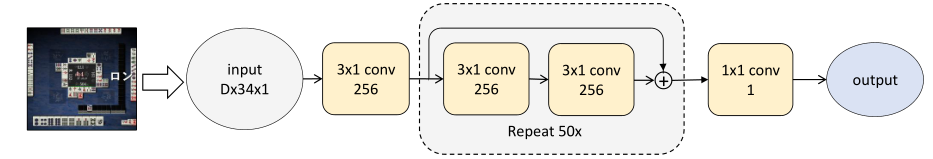

# 麻将AI文档

## 赛制说明
本次大作业国标麻将采用瑞士轮加复式赛赛制。

每匹配到的4位选手将进行4副牌墙的对比，每副牌墙将进行4盘比赛，故一共进行16盘比赛。具体来说，4副牌墙的圈风依次指定为东南西北，每副牌墙进行4盘比赛意味着4位选手的座次安排相对顺序不变，但是每个人会轮流做东（见右下角）。积分规则按“一副一比”，也即每副牌墙进行24盘将得到1个累加分，根据累加分进行排名，从高到低依次得到4/3/2/1的排名分。故每次匹配，选手将得到4个排名分。最后，选手的排名分进行累加，并得到最终的比赛名次。

复式国标麻将使用136张麻将牌，不包含8张花牌。

牌墙为随机生成，平均分成4份，每份为34张，作为指定座次（风位）的牌墙。初始手牌按座次牌墙指定。bot被分配到哪个座次，就拥有那个座次的牌墙，不能从其他牌墙中摸牌。

## 神经网络设计
有用的state信息：

1. 手牌信息。手牌不超过14张(仅开局可为14张)，可以用4个channel表示（每个channel为`bool[34]`）
2. 当前操作信息。比如打出牌需要当前摸到牌的信息（4个channel），吃/碰/杠/胡，需要当前打牌的风位（顺序：本家、下家、对家、上家），当前打出的牌（2*4个channel），一共12个channel。特殊情况：先杠再摸牌，当前打牌的风位置为本家，否则摸牌时当前打牌风位全为0。
3. 明牌信息。每个玩家的明牌不超过16张（可能有杠），可以用4个channel表示（顺序不重要）；还有一些附加信息，例如吃牌信息（第n张牌是吃的，中心牌chennel为1），碰牌信息（来自哪一家，对应channel为1，本家为0），杠牌信息（明杠同碰，本家为1；暗杠则仅本家为1）一共需要8\*4个channel，顺序是本家、下家、对家、上家
4. 门风&圈风。均可以用4个channel表示，分别编码东南西北。对应的一个channel全1，其余全0. 一共需要8个channel。圈风用相对值表示，本家-下家-对家-上家
5. 场上牌信息。每个玩家场上都只有不超过21张牌，可以用21\*4个channel表示（21编码了打牌顺序，越晚打排在越后），一共有4\*21\*4个channel，顺序是本家、下家、对家、上家。为了普适性，可以使用4\*29\*4个channel

这些信息一共需要$(1+3+8+2+4\times 29)\times 4=130\times 4=520$个channel。

除了state信息之外，还可以计算一些look-ahead features（feature engineering）。在麻将中，这主要是和上听数有关的feature。比如，打出某张牌之后，可能在两上听内胡到48番。

结合`shanten.cpp`库的结构，设计这个结构为：4个channel标记场上和手牌中已有的牌，4个channel标记打某个牌是否可以减少各种胡牌形式的上听数，4个channel标记打出某个牌是否可以使对应形式听牌（8番以上），10个channel标记打出每种牌可以听牌并胡到8番以上的概率（从.0+~.9+编码，1的个数表示概率），10个channel标记平均番数（0~100），48个channel标记各种胡型的上听数（超过10按10算）

从以上设计可知，我们一共需要520+80=600个channel，网络的输入维度就是600\*34；由于我们的大部分信息是按4channel对齐的，可以用二维网络形式：150x4x34。网络的主体采用ResNet设计：

（ResNet101，图盗）

其中，conv表示Convolutional Neural Network，只卷积，不池化、不BN（Batch Normalization）。输出结果只需要1个channel（Discard就输出可能打出的牌（在其中随机选牌打出），吃碰杠等就看1多还是0多）

## 训练过程

先使用人类玩家数据进行监督学习。

### 数据预处理

数据的格式为人类可读格式，使用`\t`为分隔符，记录一场对局中的各种操作。我们希望得到一个的ataset，具体来说，Dataset应该实现`__getitem__`，返回值为一个batch，batch的组成成分是许多对代表张量和对应结果的tensor。

需要解决的问题：

- 读取文件夹中的所有文件名，一个个传给麻将状态机
- 麻将状态机：打开文件，根据其中各种操作模拟对局
- 麻将状态机：根据当前状态生成张量，打包成一个batch
- (Optional)做train-val split，把文件分组

如果预处理后的数据放在文件夹下，最后数据预计可达1000G左右，因此在预处理阶段就完全展开是不现实的。因此考虑在运行时展开：调用iter的时候生成数据，一场对局结束时新开一个文件。考虑到数据集的庞大，可以只输出赢家的打牌方法，忽略输家。

可用的数据集大概有530000+个文件，参考CIFAR-10数据集的大小（60000x34x34），我们1000个文件其实就够用了，其中800作为训练集，200作为测试集。可以先用8+2进行测试看看效果。

### 模型训练

使用最一般的训练方法：
|选项         |描述          |
|:----------- |:------------ |
|loss function|cross entropy loss |
|optimizer    |SGD(stochastic gradient descent)|
|scheduler    |lr_scheduler  |

调用`discard_train.py`来训练模型。

待续
